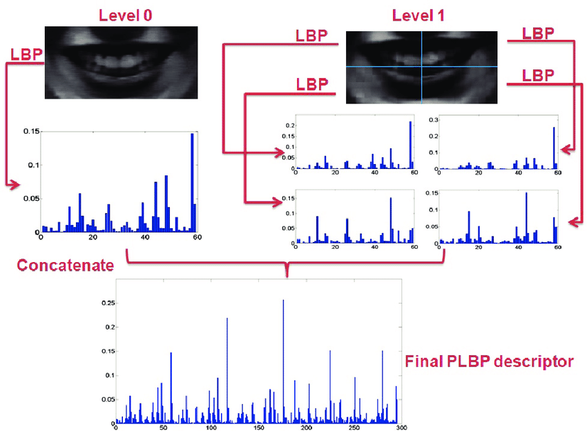

# Masked

## What?

**Masked** is a school project about [LBP](https://en.wikipedia.org/wiki/Local_binary_patterns) and mask detection.
The goal is to detect if a person wear a mask correctly from a picture of his face.

## How?

### Dataset
Link: https://mega.nz/folder/94BT0Qha#FojzXdjOcKSX-WxnuNr91g

Download the `dataset.zip` file and extract the `dataset` folder wherever you want, the root of the git directory is a good choice.

### Compilation

**Requirements:**
- CMake (>= 3.0)
- gcc (C++ >= 17)
- OpenCV
- tbb

**Steps:**
1. `cd Masked`
2. `cmake ./CMakeLists.txt -B ./output/`
3. `cd output/`
4. `make`

`Masked` executable file is in the `output` folder.

## Usage

**Train:**

``Masked train -d,--dataset "path_to_dataset_directory" (-p,--pyramid)``

**Predict:**

``Masked predict -d,--dataset "path_to_dataset_directory" (-p,--pyramid)``

The prediction process is running on parallel on every core of your CPU, be careful about temperature!

**Pyramid** option is used for data augmentation. We split the base image in smaller images and append all the descriptors. For this project, we use 3 levels :
- Level 0: Base image
- Level 1: Base image split in 4 parts (2x2)
- Level 2: Base image split in 9 parts (3x3)



## Known bugs
- Bhattacharyya doesn't work with pyramid option

## Current results

### Normal

| Algorithm | MaskedType | Ratio |
|-----------|------------|-------|
| SAD | Good | 66.84% |
| SAD | Bad | 61.14% |
| **SAD** | **Mean** | **63.99%** |
| ChiSquare | Good | 62.26% |
| ChiSquare | Bad | 64.82% |
| **ChiSquare** | **Mean** | **63.54%** |
| Bhattacharyya | Good | 67.22% |
| Bhattacharyya | Bad | 62.76% |
| **Bhattacharyya** | **Mean** | **64.99%** |
| Intersection | Good | 58.86% |
| Intersection | Bad | 27.26% |
| **Intersection** | **Mean** | **43.06%** |
| Correlation | Good | 14.76% |
| Correlation | Bad | 77.34% |
| **Correlation** | **Mean** | **46.05%** |

### Pyramid (9-patch and 4-patch)

*Coming soon...*

### Raw logs
*Running on i7 9700k, tests are running in parallel so total predict time is equal to the maximum elapsed time (218.078s ~= 3min38 for normal and 3117.57s ~= 52min)*

#### Normal
```
===== Test results =====
Algorithm: SAD
Masked: Good
Good: 3342
Bad: 1658
Total: 5000
Ratio: 0.6684
Elapsed time in seconds: 78.3305
===== Test results =====
Algorithm: SAD
Masked: Bad
Good: 3057
Bad: 1943
Total: 5000
Ratio: 0.6114
Elapsed time in seconds: 76.4814
===== Test results =====
Algorithm: ChiSquare
Masked: Bad
Good: 3241
Bad: 1759
Total: 5000
Ratio: 0.6482
Elapsed time in seconds: 171.166
===== Test results =====
Algorithm: ChiSquare
Masked: Good
Good: 3113
Bad: 1887
Total: 5000
Ratio: 0.6226
Elapsed time in seconds: 172.032
===== Test results =====
Algorithm: Bhattacharyya
Masked: Good
Good: 3361
Bad: 1639
Total: 5000
Ratio: 0.6722
Elapsed time in seconds: 175.152
===== Test results =====
Algorithm: Intersection
Masked: Bad
Good: 1363
Bad: 3637
Total: 5000
Ratio: 0.2726
Elapsed time in seconds: 187.095
===== Test results =====
Algorithm: Intersection
Masked: Good
Good: 2943
Bad: 2057
Total: 5000
Ratio: 0.5886
Elapsed time in seconds: 189.114
===== Test results =====
Algorithm: Correlation
Masked: Bad
Good: 3867
Bad: 1133
Total: 5000
Ratio: 0.7734
Elapsed time in seconds: 216.606
===== Test results =====
Algorithm: Correlation
Masked: Good
Good: 738
Bad: 4262
Total: 5000
Ratio: 0.1476
Elapsed time in seconds: 218.078
===== Test results =====
Algorithm: Bhattacharyya
Masked: Bad
Good: 3138
Bad: 1862
Total: 5000
Ratio: 0.6276
Elapsed time in seconds: 167.785
```

#### Pyramid
```
===== Test results =====
Algorithm: SAD
Masked: Good
Good: 3342
Bad: 1658
Total: 5000
Ratio: 0.6684
Elapsed time in seconds: 968.452
===== Test results =====
Algorithm: SAD
Masked: Bad
Good: 3057
Bad: 1943
Total: 5000
Ratio: 0.6114
Elapsed time in seconds: 977.363
===== Test results =====
Algorithm: ChiSquare
Masked: Bad
Good: 3241
Bad: 1759
Total: 5000
Ratio: 0.6482
Elapsed time in seconds: 2219.58
===== Test results =====
Algorithm: Intersection
Masked: Good
Good: 2943
Bad: 2057
Total: 5000
Ratio: 0.5886
Elapsed time in seconds: 2261.64
===== Test results =====
Algorithm: Intersection
Masked: Bad
Good: 1363
Bad: 3637
Total: 5000
Ratio: 0.2726
Elapsed time in seconds: 2269.04
===== Test results =====
Algorithm: Bhattacharyya
Masked: Good
Good: 0
Bad: 5000
Total: 5000
Ratio: 0
Elapsed time in seconds: 2668.72
===== Test results =====
Algorithm: Correlation
Masked: Good
Good: 477
Bad: 4523
Total: 5000
Ratio: 0.0954
Elapsed time in seconds: 3108.01
===== Test results =====
Algorithm: Correlation
Masked: Bad
Good: 4229
Bad: 771
Total: 5000
Ratio: 0.8458
Elapsed time in seconds: 3117.57
===== Test results =====
Algorithm: ChiSquare
Masked: Good
Good: 3113
Bad: 1887
Total: 5000
Ratio: 0.6226
Elapsed time in seconds: 2164.28
===== Test results =====
Algorithm: Bhattacharyya
Masked: Bad
Good: 0
Bad: 5000
Total: 5000
Ratio: 0
Elapsed time in seconds: 2604.49
```